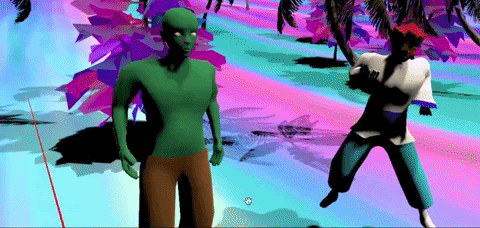
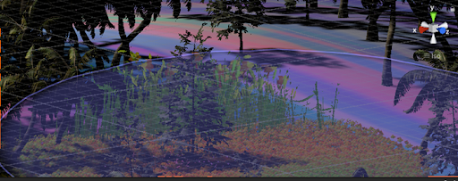
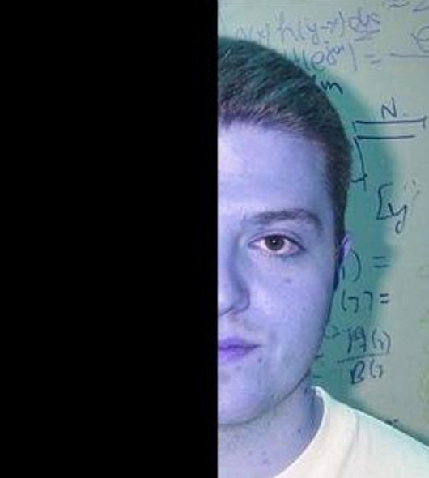
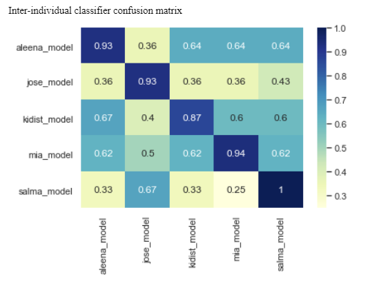
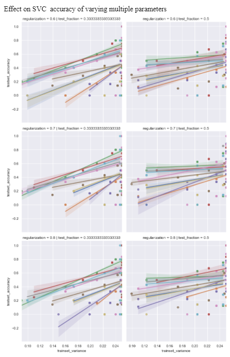
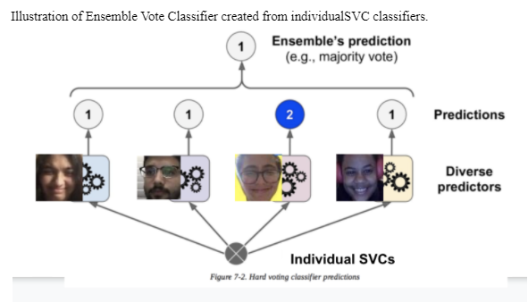

# About

Faduma Khalif is a 4th year undergraduate at MIT studying computation and cognition and concentrating in design. She likes to explore the intersection of AI and Human-Centered Design. Outside of class and the studio, she is involved with varying sustainability and community focused endeavors.

# Work

## DanceScapes
Within the world of dancing games, we found that there is a large issue of lack of representation of diverse cultures within them. With the increasing popularity of viral dances, we see that even when diverse dances become popularized they are often not rooted in their deeper cultural meaning. We aimed to create a VR experience that allowed for cross cultural exchange and representation of our respective cultures while still having these deeper spiritual roots addressed. Dancescapes is a VR experience that immerses users into a dreamlike scene in which they are able to learn how to dance. They are taught how to dance by a green spiritual guide. As they progress through the experience, they are shown more fascinating avatars: the Mmanwu and the Bongsan Talchum. These avatars are inspired by Nigerian Igbo and Korean spiritual dances respectively. <br/>
  <br/>
 

## Object Detection Under Settings of Occlusion
We want to understand how similar do certain computer vision models fare with the task of object detection under settings of occlusion compared to human subjects. We believe that human inference plays an important role when it comes to dealing with uncertainty in visual tasks and are consequently well equipped to handle ill-posed visual problems. Our findings confirm that humans quantitatively perform in a superior manner to the state of the art CNNs with an average accuracy four times greater than the most accurate CNN tested. Our results also indicate that human inference tends to classify with greater rates of confidence. We hope that gaining insight into the robustness of the human visual system will lead to more conclusions on human inference in the future. <br/>


## SongExplorer
In this project we utilized a classifier to study the behavioral evolution behind varying fly courtship songs. You can read more here: [Link](https://www.biorxiv.org/content/10.1101/2021.03.26.437280v1) <br/>


## Deep Neural Network: Like/Dislike Facial Feature Detection
A like/dislike facial feature detection based method is proposed in order to be used to utilize facial imaging data to provide a verdict on whether a given person “likes” or “dislikes” something with which they are presented. Currently, the closest algorithms to the Passive Real-Time Prediction of Like and/or dislike algorithm that is proposed in this research are emotion recognition AI algorithms. There is a gap in this body of research and technology because these algorithms are not only generally not effective, but what is even known about their effect is often debated in terms of value (i.e. can we truly objectively measure/label emotion?).The procedure for carrying out this research included presenting images to a variety of individuals and imaging their immediate reactions via frameshots of video data and live screenshots after they labelled the images as things they “liked”, “disliked”, or felt “neutral” about. Then, a keypoint detection algorithm was run and trained on the data, and finally tested. Currently, the model has an above human accuracy rate, and is significant to the field in that it is a novel way to use facial imaging data to label people as reacting to something they either “like”, “dislike”, or feel neutral about. <br/>
 <br/>




```

### Contact
email: fkhalif@mit.edu
       fkhalif [at] mit [dot] edu
